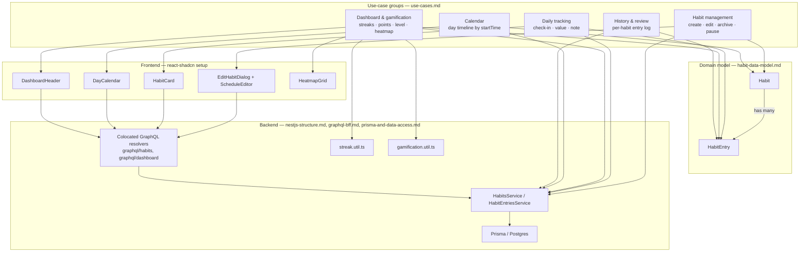

# Knowledge Graph

A bird's-eye map of how the pieces documented across `docs/` connect: domain
entities → use-case groups ([use-cases.md](use-cases.md)) → the backend code
that implements them → the frontend that surfaces them. Use it to find "if I
want to touch X, what else is involved" before diving into a specific doc.

## How to read it

- **Domain → Use cases**: which entity a use-case group primarily reads or
  writes. Dashboard & gamification and History & review both center on
  `HabitEntry` because streaks, points, heatmaps, and history are all
  *derived from* entries, never stored themselves (see "Derived data" in
  the data model doc) — this is why `streak.util.ts`/`gamification.util.ts`
  sit directly under Dashboard rather than under a generic "utils" bucket.
- **Use cases → Backend**: every group ultimately funnels through
  `HabitsService`/`HabitEntriesService` — there's no group-specific service,
  which is why those two services are the first place to look for any
  behavior change regardless of which use case prompted it.
- **Use cases → Frontend**: mostly 1:1 with a component, except Dashboard,
  which spans three (`DashboardHeader` for aggregate stats, `HabitCard` for
  per-habit stats, `HeatmapGrid` for the contribution grid) — a change to
  the points/level formula (`gamification.util.ts`) can visibly affect all
  three at once.
- **History & review has no frontend node** — matches its unchecked boxes in
  [use-cases.md](use-cases.md): the backend query (`habitEntries`) exists,
  nothing renders it yet.

## Planned: finance module

The finance module ([finance/index.md](../finance/index.md)) is designed as a
parallel subgraph: `Account → Transaction ← Category`, `Budget → Category`,
served by `FinanceModule` services and `graphql/finance/`. The only edges
into the habits graph are listed in
[finance/habits-integration.md](../finance/habits-integration.md), and they
run one way: finance writes `HabitEntry` rows through
`HabitEntriesService`. The habits code never imports finance. Add finance
to the diagram once it's built.

Regenerate this diagram (by hand — it's illustrative, not derived from code)
whenever a use case moves to a different service/component, or a new
use-case group is added to use-cases.md.
